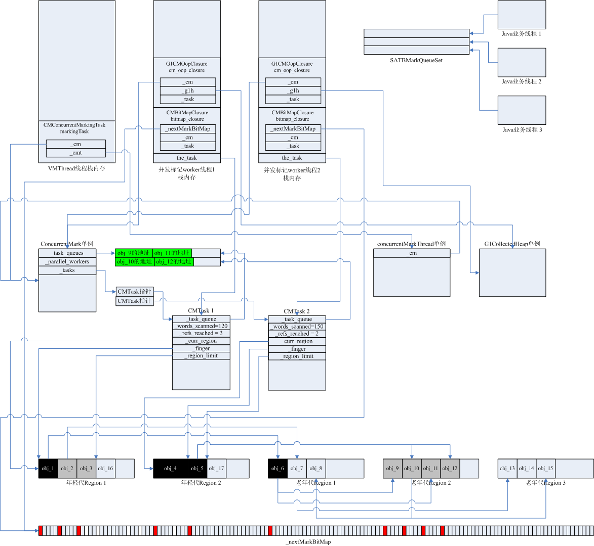

以一个实例讲述一次并发标记过程中，JVM内部数据结构组织方式、内存变化过程、多线程的执行过程。

设一次YGC完成后，紧接着进行一次Mixed GC，此时的JVM内部Java对象以及对象间的引用关系为：

- 年轻代1中分配了对象obj_1（100字节）、obj_2、obj_3，年轻代2中分配了对象obj_4、obj_5

- 老年代1中分配了对象obj_6（50字节）、obj_7（230字节）、obj_8（30字节），老年代2中分配了对象obj_9（10字节）、obj_10（70字节）、obj_11（60字节）、obj_12（80字节），老年代3中分配了对象obj_13（150字节）、obj_14、obj_15（50字节）

- obj_1引用obj_6，obj_2引用obj_7，obj_5引用obj_10和obj_12，obj_6引用obj_9和obj_11，obj_7引用obj_13，obj_10引用obj_8和obj_115

一、初始标记阶段，年轻代中所有对象都标记为灰色对象，在_nextMarkBitMap中将各个年轻代灰色对象映射到的bit置为1，然后开始并发标记过程，设VMThread启动了2个并发标记worker线程，并且此时系统中有3个Java业务线程。CMTask1记录并发标记worker线程1的工作状态，CMTask2记录并发标记worker线程2的工作状态：

- CMTask1结构中_words_scanned和_refs_reached都是0，_curr_region指向年轻代1，_finger指向obj_1的起始地址，_region_limit指向obj_3的结束地址；

- CMTask2结构中_words_scanned和_refs_reached都是0，_curr_region指向年轻代2，_finger指向obj_4的起始地址，_region_limit指向obj_5的结束地址。

此时的整体内存布局如下图所示：
 
 

 
 
 
二、2个并发标记worker线程分别开始各自的打标工作，worker 1从obj_1出发遍历到obj_1的引用对象obj_6，将obj_6视作灰色对象，在_nextMarkBitMap中将obj_6对应的bit置1，并将obj_6的地址加入CMTaskQueue队列，obj_1的所有引用属性已全部遍历完，obj_1已经是黑色对象；worker 2处理对象obj_4，obj_4并未引用其他对象，直接视作黑色对象，worker 2将根据_nextMarkBitMap中下一个置1的bit去处理obj_5。

此时的整体内存布局如下图所示：
 
 

 
 
 
三、worker 1继续执行深度优先遍历，从CMTaskQueue队列取出obj_6的地址，遍历obj_6的所有引用属性，obj_6引用了obj_9和obj_11，所以将obj_9和obj_11视作灰色对象，在_nextMarkBitMap中将obj_9和obj_11对应的bit置为1，将obj_9和obj_11的地址加入CMTaskQueue队列，obj_6的所有引用属性已遍历完，被视为黑色对象；worker 2将CMTask2的_finger指针指向对象obj_5的起始地址，遍历obj_5的所有引用属性，obj_5引用了obj_10和obj_12，所以将obj_10和obj_12视作灰色对象，在_nextMarkBitMap中将obj_10和obj_12对应的bit置为1，将obj_10和obj_12的地址加入CMTaskQueue队列，obj_5的所有引用属性已遍历完，被视为黑色对象。并发标记线程工作期间，Java业务线程也在工作，假设Java业务线程在年轻代1中新分配了对象obj_16，在年轻代2中新分配了对象obj_17（60字节）。

此时的整体内存布局如下图所示：
 
 

 
 
 
四、worker 1完成从obj_1开始的深度遍历打标，将CMTask1的_finger指针指向对象obj_2的起始地址，obj_2引用obj_7，将obj_7视作灰色对象，在_nextMarkBitMap中将obj_7对应的bit置1，并将obj_7的地址加入CMTaskQueue队列，obj_2的所有引用属性已全部遍历完，obj_2被视作黑色对象；worker 2从CMTaskQueue队列取出obj_10的地址，遍历obj_10的所有引用属性，obj_10引用了obj_8和obj_15，所以将obj_8和obj_15视作灰色对象，在_nextMarkBitMap中将obj_8和obj_15对应的bit置为1，将obj_8和obj_15的地址加入CMTaskQueue队列，obj_10的所有引用属性已遍历完，被视为黑色对象，再从CMTaskQueue队列取出obj_12的地址，obj_12不引用任何对象，直接被视作黑色对象。

此时的整体内存布局如下图所示：
 
 

 
 
 
五、worker 1从CMTaskQueue队列取出obj_7的地址，遍历obj_7的引用属性，完成obj_13的打标；worker 2从CMTaskQueue队列取出obj_8、obj_15的地址并完成打标，至此worker 2的标记工作已完成，年轻代2中新分配的对象obj_17、obj_18，将在remark阶段被打标。此时Java业务线程修改了obj_1的引用属性，obj_1不再引用obj_6，改为引用obj_17。为防止漏标，obj_1重新被视作灰色对象，obj_1的地址被加入SATBMarkQueue队列。

此时的整体内存布局如下图所示：
 
 

 
 
 
六、worker 1在处理obj_3之前，先处理SATBMarkQueue队列中的obj_1，将obj_1视作灰色对象，重新以obj_1为根做引用属性的深度优先遍历，将obj_1的地址加入到CMTaskQueue队列。

此时的整体内存布局如下图所示：
 
 

 
 
 
七、在obj_1的引用属性遍历过程中，obj_17被打标。处理完SATBMarkQueue队列的数据，worker 1继续处理obj_3，obj_3处理完成后worker 1的打标工作也已完成。随后在remark过程中，新产生的对象obj_16、obj_18都被视作黑色对象，完成打标。

remark过程结束后整体内存布局如下图所示：
 
 

 
 
 
