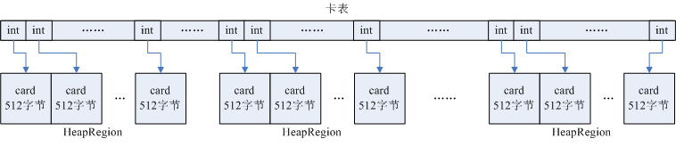
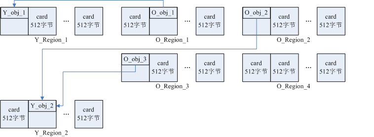

[RSet用途](#jump_1)

[RSet相关源码解析](#jump_2)

## RSet用途
Remembered Set数据结构用于记录老年代分区到年轻代分区的引用，每一个年轻代的HeapRegion对象都有一个指针指向自己的RSet对象。

在YGC过程中，回收的是年轻代中的不再使用的对象，除了以Java线程栈上的引用变量为根去深度遍历年轻代中的对象外，还要以老年代对象为根去遍历年轻代中的对象。但老年代空间远大于年轻代空间，不可能对老年代的所有对象全部扫描一遍，因此使用空间换时间的算法，为每一个年轻代的Region新建一个RSet数据结构，在RSet中记录引用了该年轻代Region中对象的老年代对象所处的card的索引。在YGC过程中，不用去扫描老年代，直接从每个年轻代的RSet出发，就能找到所有引用了年轻代对象的老年代对象（先找到老年代对象所处的card，再从card中寻找引用了年轻代对象的老年代对象），并以这些老年代对象为根再去深度遍历年轻代中的对象。

卡表（card table）的概念：

在G1中，每一个HeapRegion又分为若干card，每一个card占据空间为512字节，并且维护一个全局卡表，即card table，卡表是一个整型数组，每一个int元素都对应一个card，int值表示card的当前状态（脏card表示card中的对象的引用发生了变化），每一个card的地址值除以512就是该card对应的int元素在卡表中的索引号。

Region与卡表的关系如下图所示：

  
  
下例中，设老年代对象O_obj_1引用年轻代对象Y_obj_1，老年代对象O_obj_2、O_obj_3引用年轻代对象Y_obj_2，则年轻代Region Y_Region_1和Y_Region_2的RSet结构如下图所示：

  

## RSet相关源码解析

RSet在内部使用Per Region Table(PRT)记录分区的引用情况。

在PRT中将会以三种模式记录引用：稀少、细粒度、粗粒度（粗粒度的PRT只是记录了引用数量，需要通过整堆扫描才能找出所有引用，因此扫描速度也是最慢的）

