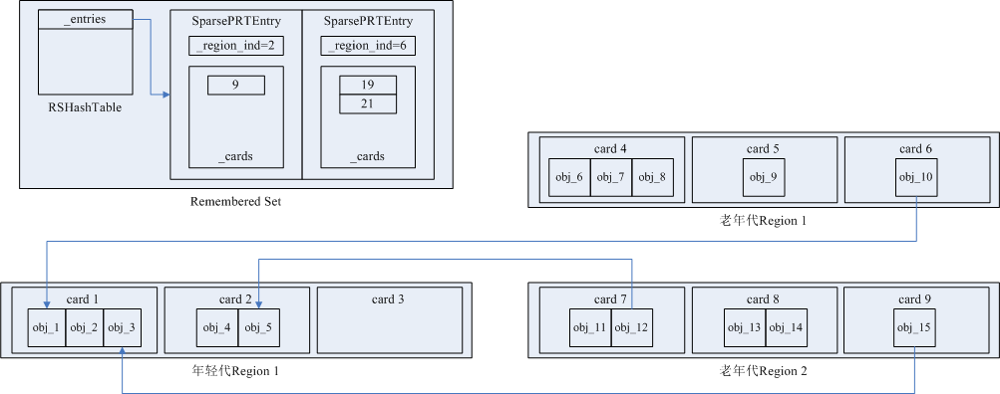
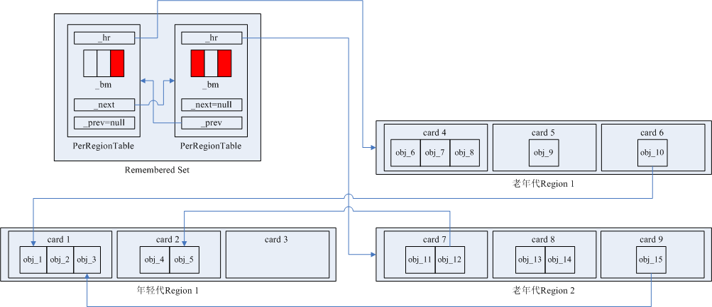
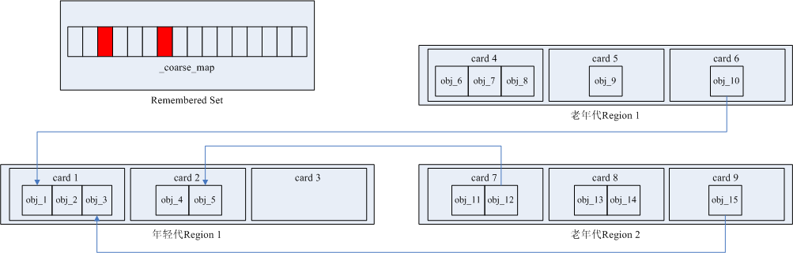

[OtherRegionsTable数据结构](#jump_1)

[常用原子操作](#jump_2)

[SparsePRT数据结构](#jump_3)

[PerRegionTable数据结构](#jump_4)

[粗粒度BitMap](#jump_5)

## <span id="jump_1">OtherRegionsTable数据结构</span>
在hotspot源码中，Remembered Set整体数据结构的定义为HeapRegionRemSet类， Remembered Set的三级粒度存储结构以及对Remembered Set的操作都封装在HeapRegionRemSet的成员变量OtherRegionsTable类实例中：
```c++
class HeapRegionRemSet : public CHeapObj<mtGC> {
private:
  OtherRegionsTable _other_regions;
}
```

在OtherRegionsTable类中，定义了Remembered Set的三级粒度存储结构，分别为：

- SparsePRT：

- PerRegionTable：

- BitMap：

OtherRegionsTable类的主要成员变量有：
```c++
class OtherRegionsTable VALUE_OBJ_CLASS_SPEC {
  // 指向OtherRegionsTable所属的HeapRegion实例的指针，所有引用了_hr所指的HeapRegion内存区中Java对象的其他对象所在的Card或HeapRegion，都在本OtherRegionsTable中被记录
  HeapRegion*      _hr;
  Mutex*           _m;

  // 如果引用了_hr所指的HeapRegion内存区中Java对象的Card过多，为节省内存，只用一个bitmap记录引用者所在的各个HeapRegion
  // _coarse_map是Remembered Set的三级粒度存储结构中粒度最粗的一级
  BitMap      _coarse_map;  
  size_t      _n_coarse_entries;
  static jint _n_coarsenings;

  // 
  PerRegionTable** _fine_grain_regions;
  size_t           _n_fine_entries;

  PerRegionTable * _first_all_fine_prts;
  PerRegionTable * _last_all_fine_prts;

  // Used to sample a subset of the fine grain PRTs to determine which
  // PRT to evict and coarsen.
  size_t        _fine_eviction_start;
  static size_t _fine_eviction_stride;
  static size_t _fine_eviction_sample_size;

  SparsePRT   _sparse_table;

  // These are static after init.
  static size_t _max_fine_entries;
  static size_t _mod_max_fine_entries_mask;
};
```

## <span id="jump_2">常用原子操作</span>
使用到的CAS原子操作
```c++
// 判断dest是否等于compare_value，如果等于，将dest赋值为exchange_value，并返回dest的原值；
// 如果不等于，什么都不做，返回dest的值
inline void* Atomic::cmpxchg_ptr(void* exchange_value, volatile void* dest, void* compare_value) {
  // cmpxchg内部为汇编实现
  return (void*)cmpxchg((jlong)exchange_value, (volatile jlong*)dest, (jlong)compare_value);
}
```

## <span id="jump_3">SparsePRT数据结构</span>
当引用者Card数量不是很多时，可以记录全部的引用者Region、Card，具体实现为SparsePRT类。

SparsePRT类主要的成员变量有：
```c++
class SparsePRT VALUE_OBJ_CLASS_SPEC {
  RSHashTable* _cur;
  RSHashTable* _next;

  HeapRegion* _hr;  // 存储引用者Java对象的HeapRegion实例的地址

  // 一个SparsePRT对象初始化时，内部_next指向的第一个RSHashTable对象的存储容量
  enum SomeAdditionalPrivateConstants {
    InitialCapacity = 16
  };

  SparsePRT* _next_expanded;

  // 静态变量，全局唯一的SparsePRT对象列表，各个RSet的执行过expand()操作的SparsePRT对象都被加入该链表中
  static SparsePRT* _head_expanded_list;
};
```

SparsePRT类主要的成员函数的源码解析：

构造函数：
```c++
SparsePRT::SparsePRT(HeapRegion* hr) :
  _hr(hr), _expanded(false), _next_expanded(NULL)  // 新建的SparsePRT对象不在_head_expanded_list链表中，_expanded初始化为false
{
  // 新建第一个RSHashTable对象，_cur和_next都指向该RSHashTable对象
  _cur = new RSHashTable(InitialCapacity);
  _next = _cur;
}
```

将SparsePRT对象加入到_head_expanded_list链表：
```c++
// 会被多线程调用，需要CAS来做多线程同步
void SparsePRT::add_to_expanded_list(SparsePRT* sprt) {
  // 已经执行过expand()的SparsePRT对象肯定已经在_head_expanded_list链表中，直接返回
  if (sprt->expanded()) return;
  sprt->set_expanded(true);
  SparsePRT* hd = _head_expanded_list;
  while (true) {
    // 将sprt所指的SparsePRT对象的_next_expanded指针指向链表头节点
    sprt->_next_expanded = hd;
    // CAS原子操作，判断当前的链表头节点的地址是否与之前看到的头节点地址相等，
    // 1、如果相等，说明链表没有被其他线程更改过，将_head_expanded_list指针的值赋值为sprt，即sprt所指的SparsePRT对象成为链表头节点，
    //    cmpxchg_ptr返回时res赋值为链表原先头节点的地址
    // 2、如果不等，说明链表已被其他线程更改，什么也不做，cmpxchg_ptr返回时res赋值为链表当前最新头节点的地址
    SparsePRT* res =
      (SparsePRT*)
      Atomic::cmpxchg_ptr(sprt, &_head_expanded_list, hd);
    // 将sprt所指的SparsePRT对象成功插入到链表的最前端，返回  
    if (res == hd) return;
    // 更新hd指针为链表当前最新头节点的地址，下一轮while循环内继续尝试将将sprt所指的SparsePRT对象插入到链表的最前端
    else hd = res;
  }
}
```

从_head_expanded_list链表中摘取最靠前的一个SparsePRT对象：
```c++
// 会被多线程调用，需要CAS来做多线程同步
SparsePRT* SparsePRT::get_from_expanded_list() {
  SparsePRT* hd = _head_expanded_list;
  while (hd != NULL) {
    SparsePRT* next = hd->next_expanded();
    SparsePRT* res =
      (SparsePRT*)
      Atomic::cmpxchg_ptr(next, &_head_expanded_list, hd);
    if (res == hd) {
      hd->set_next_expanded(NULL);
      return hd;
    } else {
      hd = res;
    }
  }
  return NULL;
}
```

将SparsePRT的存储量加大一倍：
```c++
void SparsePRT::expand() {
  RSHashTable* last = _next;
  _next = new RSHashTable(last->capacity() * 2);

#if SPARSE_PRT_VERBOSE
  gclog_or_tty->print_cr("  Expanded sparse table for %u to %d.",
                         _hr->hrm_index(), _next->capacity());
#endif
  for (size_t i = 0; i < last->capacity(); i++) {
    SparsePRTEntry* e = last->entry((int)i);
    if (e->valid_entry()) {
#if SPARSE_PRT_VERBOSE
      gclog_or_tty->print_cr("    During expansion, transferred entry for %d.",
                    e->r_ind());
#endif
      _next->add_entry(e);
    }
  }
  if (last != _cur) {
    delete last;
  }
  add_to_expanded_list(this);
}
```

RSHashTable类主要的成员变量有：
```c++
class RSHashTable : public CHeapObj<mtGC> {
  size_t _capacity;
  size_t _capacity_mask;
  size_t _occupied_entries;  // 
  size_t _occupied_cards;  // 存储的卡表索引号的数量

  SparsePRTEntry* _entries;
  int* _buckets;
  int  _free_region;
  int  _free_list;
};
```

SparsePRTEntry类主要的成员变量有：
```c++
class SparsePRTEntry: public CHeapObj<mtGC> {

private:
  RegionIdx_t _region_ind;  // 引用者Java对象所在的Region在全局Region表中的索引号
  int         _next_index;
  CardIdx_t   _cards[1];  // 柔性数组，存储引用者Java对象所在的Card号
};
```

当Remembered Set使用SparsePRT粒度存储结构，内存布局可如下图所示：
<br/>



<br/>
<br/>

## <span id="jump_4">PerRegionTable数据结构</span>
当SparsePRT结构中记录的Card数量超过阈值时，降级为使用PerRegionTable结构，在PerRegionTable中不会记录每一个Card的编号，而是使用位图bitmap来记录Card，以节省内存使用量。

PerRegionTable类主要的成员变量、成员函数的源码解析：
```c++
class PerRegionTable: public CHeapObj<mtGC> {

  // 引用者Java对象所处内存空间对应的HeapRegion对象的指针
  HeapRegion*     _hr;
  // _bm位图记录_hr所指的Region中的各个引用者Card，_bm位图大小等于Region中的Card数量，
  // 位图的一个bit代表一个Card，每一个bit的索引都代表一个Card相对于Region中第一个Card的偏移量
  BitMap          _bm;
  // 记录_bm位图中置为1的bit的数量，即Card的个数
  jint            _occupied;

  // 一个Remembered Set中的所有PerRegionTable串在一个链表里，_next和_prev是指向相邻PerRegionTable的指针
  PerRegionTable* _next;
  PerRegionTable* _prev;

  // next pointer in collision list
  PerRegionTable * _collision_list_next;

  // _free_list是静态指针，指向全局的空闲列表，用于PerRegionTable的分配
  static PerRegionTable* _free_list;

protected:

  // 返回_bm位图置为1的bit的数量，即Card的个数
  void recount_occupied() {
    _occupied = (jint) bm()->count_one_bits();
  }

  PerRegionTable(HeapRegion* hr) :
    _hr(hr),
    _occupied(0),
    _bm(HeapRegion::CardsPerRegion, false /* in-resource-area */),  // _bm位图的大小为Region中的Card数量
    _collision_list_next(NULL), _next(NULL), _prev(NULL)
  {}

  // 增加一个Card的记录
  // from_card表示新增加的Card相对于_hr表示的Region中第一个Card的偏移量
  // par表示是否多线程调用
  void add_card_work(CardIdx_t from_card, bool par) {
    if (!_bm.at(from_card)) {  // 如果_bm位图上from_card映射到的bit不是1，则将其置为1，并累加_occupied
      if (par) {
        if (_bm.par_at_put(from_card, 1)) {
          Atomic::inc(&_occupied);
        }
      } else {
        _bm.at_put(from_card, 1);
        _occupied++;
      }
    }
  }

  // 为老年代对象对年轻代对象的一个引用在_bm位图中将相应的bit置为1
  void add_reference_work(OopOrNarrowOopStar from, bool par) {

    HeapRegion* loc_hr = hr();

    if (loc_hr->is_in_reserved_raw(from)) {
      // 计算引用者对象内存地址相对于引用者所在Region内存底部地址的偏移量
      size_t hw_offset = pointer_delta((HeapWord*)from, loc_hr->bottom());
      // 计算引用者所在的Card相对于Card所在的Region中第一个Card的偏移量
      CardIdx_t from_card = (CardIdx_t)
          hw_offset >> (CardTableModRefBS::card_shift - LogHeapWordSize);

      assert(0 <= from_card && (size_t)from_card < HeapRegion::CardsPerRegion,
             "Must be in range.");
      // 更新_bm位图、_occupied计数器
      add_card_work(from_card, par);
    }
  }

public:

  // Returns an initialized PerRegionTable instance.
  static PerRegionTable* alloc(HeapRegion* hr) {
    PerRegionTable* fl = _free_list;
    while (fl != NULL) {
      PerRegionTable* nxt = fl->next();
      PerRegionTable* res =
        (PerRegionTable*)
        Atomic::cmpxchg_ptr(nxt, &_free_list, fl);
      if (res == fl) {
        fl->init(hr, true);
        return fl;
      } else {
        fl = _free_list;
      }
    }
    assert(fl == NULL, "Loop condition.");
    return new PerRegionTable(hr);
  }
  
};
```

当Remembered Set使用PerRegionTable粒度存储结构，内存布局可如下图所示：
<br/>



<br/>
<br/>

## <span id="jump_5">粗粒度BitMap</span>
如果PerRegionTable中记录的Card数量超过阈值时，再次降级，不再记录Card，而是只用一个bitmap记录引用者对象所在的Region。

当Remembered Set使用CoarseMap粒度存储结构，内存布局可如下图所示：
<br/>


