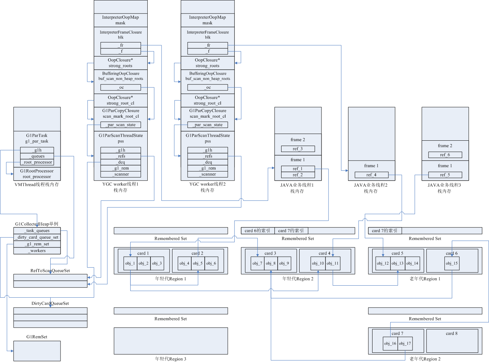
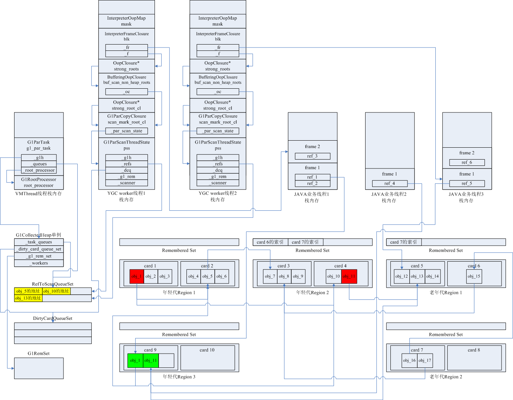
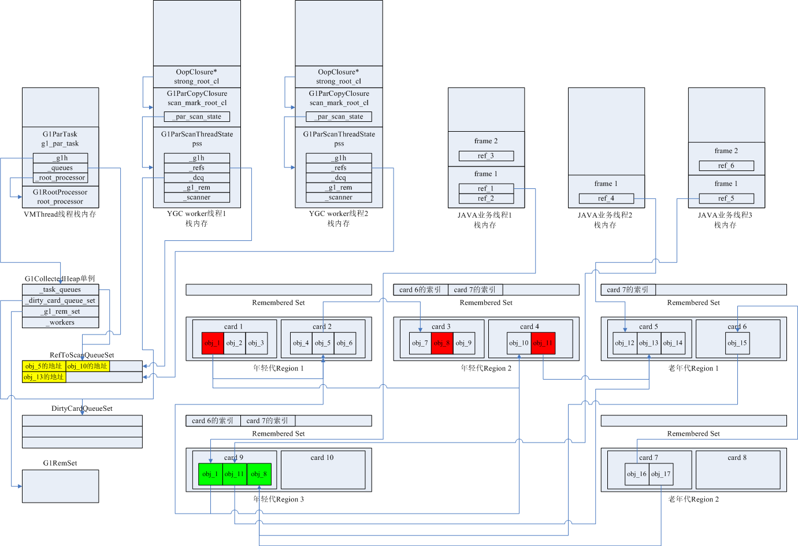
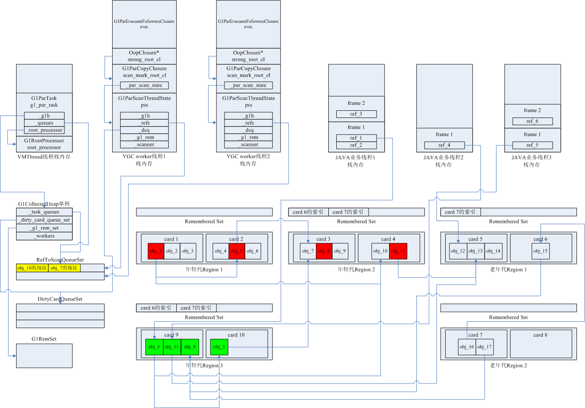
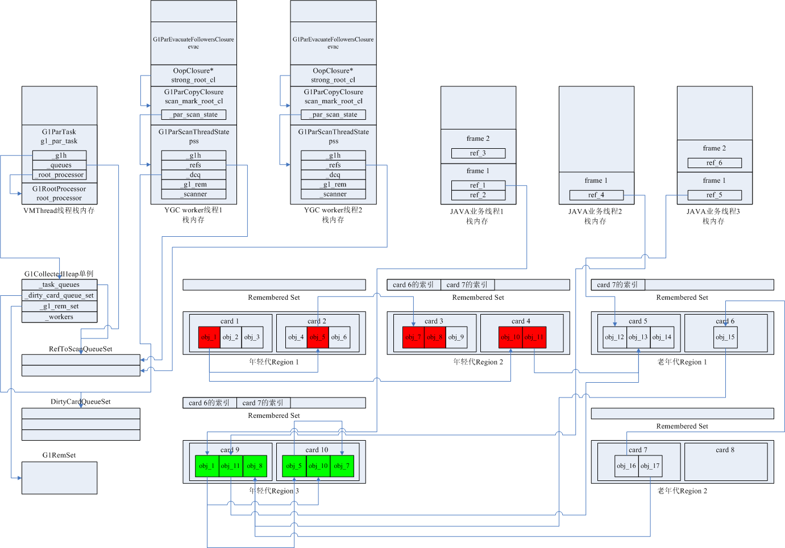
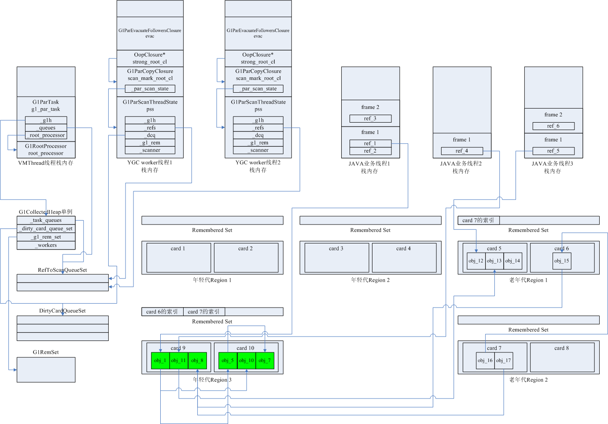

假设一次YGC开始时，JVM内部运行状态如下：

- 年轻代1中的Card 1分配了对象obj_1、obj_2、obj_3，Card 2分配了对象obj_4、obj_5、obj_6

- 年轻代2中的Card 3分配了对象obj_7、obj_8、obj_9，Card 4分配了对象obj_10、obj_11

- 老年代1中的Card 5分配了对象obj_12、obj_13、obj_14，Card 6分配了对象obj_15

- 老年代2中的Card 7分配了对象obj_16、obj_17

- obj_1引用了obj_5、obj_10，obj_5引用了obj_7，obj_11引用了obj_13，obj_15引用了obj_8，obj_16引用了obj_15，obj_17引用了obj_8

- 年轻代2的Remembered Set记录了Card6的卡表索引和Card7的卡表索引，老年代1的Remembered Set记录了Card7的卡表索引

- JVM运行了3个Java业务线程，线程栈1中的引用变量ref_1引用年轻代对象obj_1，线程栈2中的引用变量ref_4引用年轻代对象obj_11，线程栈3中的引用变量ref_5引用老年代对象obj_12

- VMThread线程启动了2个YGC worker线程

一、YGC worker 1准备开始处理Java线程栈1中的栈帧frame 1，YGC worker 2准备开始处理Java线程栈2中的栈帧frame 1，此时的JVM内存布局如下图所示：
 
 

 
 
 

二、YGC worker 1将obj_1复制到年轻代3，并将ref_1指向新复制的年轻代3中的obj_1，再将原obj_1引用的obj_5和obj_10的地址加入RefToScanQueue队列，处理完Java线程栈1中的frame 1后，准备去处理Java线程栈1中的frame 2；同理，YGC worker 2将obj_11复制到年轻代3，并将ref_4指向新复制的年轻代3中的obj_11，再将原obj_11引用的obj_13的地址加入RefToScanQueue队列，此时Java线程栈2已全部处理完，YGC worker 2准备去处理Java线程栈3。此时的JVM内存布局如下图所示：
 
 

 
 
 

三、Java线程栈1中的frame 2未引用年轻代对象，Java线程栈3只引用了老年代对象，未引用年轻代对象，此时以Java线程栈的引用变量出发搜索年轻代存活对象的工作已完成，开始以老年代对象为根搜索存活的年轻代对象，因此obj_8被复制到年轻代3中，年轻代3的Remembered Set也被更新。此时的JVM内存布局如下图所示：
 
 

 
 
 

四、以老年代对象为根搜索存活的年轻代对象完成，开始处理RefToScanQueue队列，进行深度优先遍历，遍历到的每个对象都要复制到年轻代3中，并将该对象的所有引用属性再加入RefToScanQueue队列。此时的JVM内存布局如下图所示：
 
 

 
 
 

五、直到RefToScanQueue队列完全被清空，深度遍历存活对象的工作才完成，此时的JVM内存布局如下图所示：
 
 

 
 
 

六、已被复制的对象和深度遍历未达到的对象，都要被清理掉，此时的JVM内存布局如下图所示：
 
 

