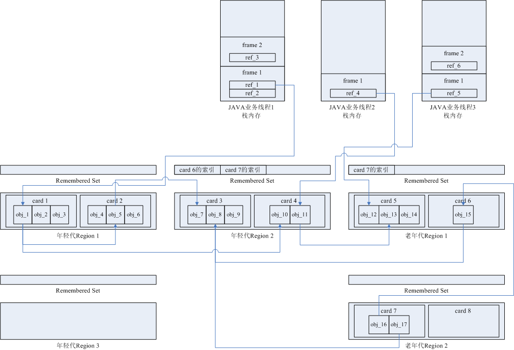
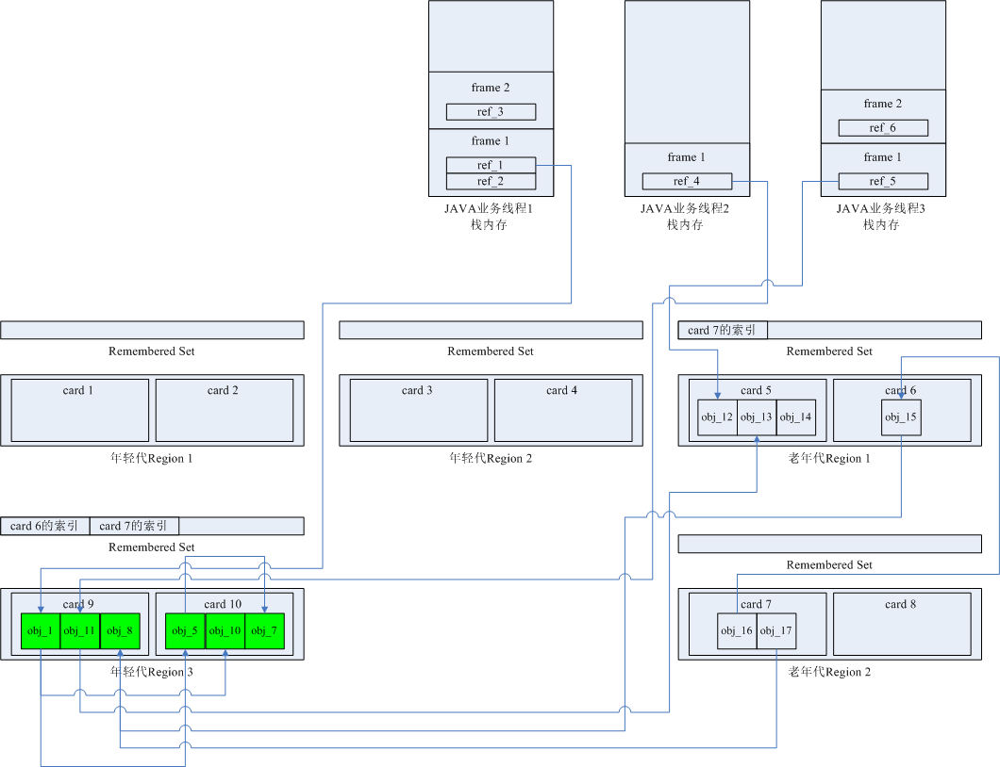

[YGC原理](#jump_1)

[一次YGC过程的示例](#jump_2)

## YGC原理

## 一次YGC过程的示例

以java线程栈的局部变量和老年代的对象为根进行标记

以老年代为根时，因为老年代太大，不去扫描老年代，而是从年轻代的RSet出发，看RSet是否记录的是老年代的card。因为RSet记录的是引用者的card，所以扫描年轻代所有的RSet即可达到目的，找到所有老年代对象到年轻代的引用。是空间换时间的算法。

如果一个old generation的对象引用了young generation，那么这个old generation的对象肯定也属于Strong root的一部分，这部分逻辑并没有在process_strong_roots中实现，而是在绿色框中实现了，其中rem_set中保存了old generation中dirty card的对应区域，每次对象的拷贝移动都会检查一下是否产生了新的跨代引用，比如有对象晋升到了old generation，而该对象还引用了young generation的对象，这种情况下会把相应的card置为dirty，下次YGC的时候只会扫描dirty card所指内存的对象，避免扫描所有的old generation对象。

拷贝对象的目标空间不一定是to-space，也有可能是old generation，如果一个对象经历了很多次YGC，会从young generation直接晋升到old generation，为了记录对象经历的YGC次数，在对象头的mark word 数据结构中有一个位置记录着对象的YGC次数，也叫对象的年龄，如果扫描到的对象，其年龄小于某个阈值（tenuring threshold），该对象会被拷贝到to-space，并增加该对象的年龄，同时to-space的_top指针也会往后移动，这个新对象等待着被扫描。

如果该对象的年龄大于某个阈值，会晋升到old generation，或者在拷贝到to-space时空间不足，也会提前晋升到old generation，晋升过程通过老年代_next_gen的promote方法实现，如果old generation也没有足够的空间容纳该对象，则会触发晋升失败。

调用do_oop_evac复制一般对象，调用do_oop_partial_array处理大数组对象

do_oop_partial_array

from_obj_array 原数组对象

to_obj_array 原数组对象拷贝到新内存空间的对象

from_obj 原数组对象中本次开始处理的对象

to_obj  拷贝后的数组对象，并不是原数组对象的全部，是一部分一部分拷贝的，to_obj指本次处理的from_obj拷贝到的新位置的对象

YGC过程中每个并发线程如何指定各自处理的CSet ？

